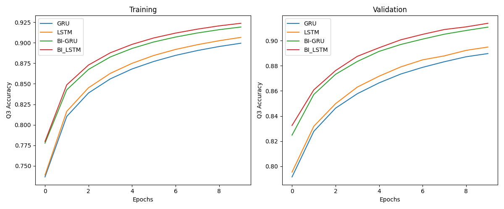

# Protein Secondary Structure Prediction using Neural Networks

This project aims to leverage neural networks to accurately predict protein secondary structures while evaluating the performance of various RNN models for optimal results.

This project was written by [Florian](https://www.linkedin.com/in/XX/), [Jun Kai](https://www.linkedin.com/in/yipjk/) and [Min Jie](https://www.linkedin.com/in/XX/).

The dataset for this project is sourced from [Alfrandom - Protein Secondary Structure (Kaggle)](https://www.kaggle.com/datasets/alfrandom/protein-secondary-structure).

## Previous runs

| Model   | Accuracy | Description                                                                                                                                                                    | Link                                                                                                   |
| ------- | -------- | ------------------------------------------------------------------------------------------------------------------------------------------------------------------------------ | ------------------------------------------------------------------------------------------------------ |
| GRU     | 89%      | Selected for its efficiency and ability to capture dependencies in sequential data. Faster to train than LSTMs while still providing strong performance.                       | [View Notebook](https://colab.research.google.com/drive/1bu4d0PFq-xVHjNbFBdoKCjQPnkuCraOO?usp=sharing) |
| LSTM    | 89%      | Effective in handling long-range dependencies and mitigating the vanishing gradient problem. Suited for complex sequence prediction tasks.                                     | [View Notebook](https://colab.research.google.com/drive/1bhPuqLQtwF6GSRCO1RnPC3pL1JFizU9S?usp=sharing) |
| BI-GRU  | 91%      | Improves context capture by considering sequences in both forward and backward directions. Enhances performance in tasks like text classification.                             | [View Notebook](https://colab.research.google.com/drive/1Qfu4eseFzlBexhAWWMl0Nrzmf4LUNPaA?usp=sharing) |
| BI-LSTM | 91%      | Processes data in both directions, leveraging information from past and future states. Ideal for nuanced understanding in tasks like language modeling and sentiment analysis. | [View Notebook](https://colab.research.google.com/drive/1g5FtOeL34uxMCgcDiee0Hs8rQhtCsRso?usp=sharing) |

Comparison done in [Google Colab](https://colab.research.google.com/drive/1VjYO96ouZbZEeGzineEPOOiUi_iTAcr1?usp=sharing).

**Note**: All models were run using the same hyperparameters and on the same hardware (L4 in Colab).

## Project overview

### Dataset

The main dataset lists peptide sequences and their corresponding secondary structures. It is a transformation of [rcsb](https://cdn.rcsb.org/etl/kabschSander/ss.txt.gz) downloaded at 2018-06-06 from RSCB PDB into a tabular structure. If you download the file at a later time, the number of sequences in it will probably increase.

| **Column**        | **Description**                                                                         |
| ----------------- | --------------------------------------------------------------------------------------- |
| **pdb_id**        | The ID used to locate the peptide's entry on [RCSB PDB](https://www.rcsb.org/).         |
| **chain_code**    | Code indicating a specific chain when a protein consists of multiple peptides (chains). |
| **seq**           | Amino acid sequence of the peptide.                                                     |
| **sst8**          | Eight-state (Q8) secondary structure classification.                                    |
| **sst3**          | Three-state (Q3) secondary structure classification.                                    |
| **len**           | Length of the peptide sequence.                                                         |
| **has_nonstd_aa** | Indicates whether the peptide contains nonstandard amino acids (B, O, U, X, or Z).      |

## Models

### Preprocessing

1. **Sub Selection:** Sequences with standard AA and of (100 < length < 300 ) are selected.
2. **Kmers:** The amino acid sequences (seq) are split into k-mers of length 3 using the seq2kmers function. This divides each sequence into overlapping substrings, helping the model capture local sequence patterns.
3. **Input Tokenization:** The k-mers are then tokenized for embedding.
4. **Target tokenization:** The target secondary structure labels are one-hot encoded to prepare them for classification.

### Model structure

| **Component**          | **Description**                                                                                                                                                                | **Input Dimensions**        | **Output Dimensions**          |
| ---------------------- | ------------------------------------------------------------------------------------------------------------------------------------------------------------------------------ | --------------------------- | ------------------------------ |
| **Embedding Layer**    | Maps each tokenized k-mer to a 128-dimensional vector. `n_words` is the vocabulary size from tokenization.                                                                     | `(MAX_AMINO_ACID_LEN,)`     | `(MAX_AMINO_ACID_LEN, 128)`    |
| **_{MODEL}_ Layers**   | Two _{MODEL}_ layers, each with 128 units, process sequence data and capture dependencies. Both layers return sequences, enabling per-residue secondary structure predictions. | `(MAX_AMINO_ACID_LEN, 128)` | `(MAX_AMINO_ACID_LEN, 128)`    |
| **Dropout Layers**     | Dropout of 0.2 after each LSTM layer to reduce overfitting.                                                                                                                    | `(MAX_AMINO_ACID_LEN, 128)` | `(MAX_AMINO_ACID_LEN, 128)`    |
| **Dense Output Layer** | A softmax layer outputs probabilities across `n_ssts` classes (three-state or eight-state classification).                                                                     | `(MAX_AMINO_ACID_LEN, 128)` | `(MAX_AMINO_ACID_LEN, n_ssts)` |

## Acknowledgments

- **Alfrandom**: For providing the dataset through [Alfrandom - Protein Secondary Structure](https://www.kaggle.com/datasets/alfrandom/protein-secondary-structure).

Thank you!
